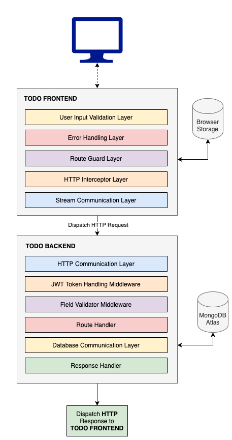

## :copyright: todo-app-frontend
> _Demonstration of Todo application with minimum UIs._

## :book: Table of Contents
   <!-- START doctoc generated TOC please keep comment here to allow auto update -->
   <!-- DON'T EDIT THIS SECTION, INSTEAD RE-RUN doctoc TO UPDATE -->

- [System Diagram](#sparkles-system-diagram)
- [Prerequisites](#sparkles-prerequisites)
- [Getting started](#sparkles-getting-started)
- [How to use](#sparkles-how-to-use)
- [Deployment](#sparkles-deployment)
- [Technologies](#sparkles-technologies)
- [License](#sparkles-license)

   <!-- END doctoc generated TOC please keep comment here to allow auto update -->

## :sparkles: System Diagram



## :sparkles: Prerequisites

Proceed with next steps if your platform meet following recommended prerequisite.

- Install [Node.js](https://nodejs.org/en/) (14 LTS) on your device.

## :sparkles: Getting Started
Run the following command under `todo-app-frontend` directory to install dependencies.
 ```
 npm install
 ```

## :sparkles: How to Use

Here is the list of tasks available out of the box and run these via `npm run <task>`.
 ```
   clean             Clean distribution folder
   build             Perform webpack build and generates bundle
   watch             Run development application on watch mode
 ```

## :sparkles: Deployment
Run the following command on browsers with HTTPS to direct access to application resources.
 ```
 https://prod-todo.brilliant-apps.club
 ```

## :sparkles: Technologies

Usage          	            | Technology
 --------------------------	| --------------------------
Language                    | TypeScript
Framework     	            | Angular
Stream Communication        | RxJS
UI Frameworks               | Bootstrap, NGX Bootstrap
Authentication              | JWT
Bundler           	        | Webpack
Code Quality Tools         	| TS Lint
Dependency Registries      	| NPM

## :sparkles: License

Todo API Frontend is MIT licensed. Please refer LICENSE for more information.
